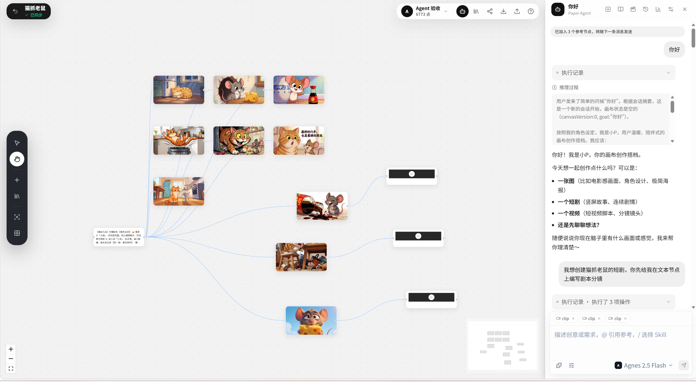
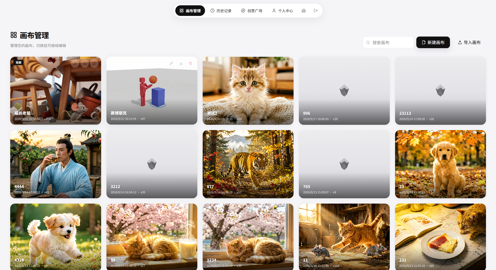
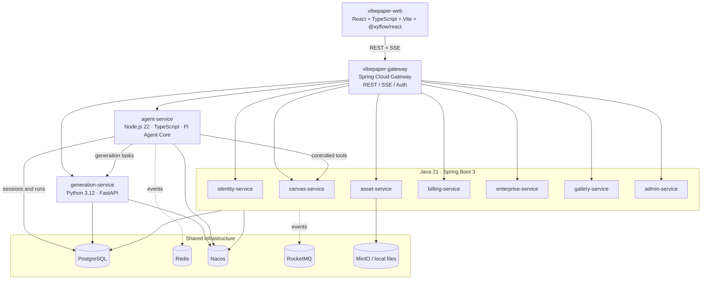

# Pi-Paper

**An AI-native node-based infinite canvas for creative production**

Pi-Paper is an AI-native creative workspace built around an infinite canvas. Text, images, video, audio, prompts, and production notes become connected nodes; the Agent helps turn an idea into an editable, reproducible workflow:

**Idea → Generation → Editing → Composition → Export**

> This repository is a personal learning and experimentation project under active development. It aims to reproduce confirmed product capabilities and key interactions from vibepaper-ai.com without using its trademarks, copyrighted assets, or proprietary algorithms.

---

## Branches

| Branch | Purpose |
|--------|---------|
| dev | Default branch; integrates the latest Node.js + Pi Agent Core version and full-stack development work |
| main | Python-based branch; preserves the Python runtime baseline for agent-service and generation-service |

---

## Feature Overview

| Capability | Description |
|------------|-------------|
| Canvas-first creation | Pan and zoom across an infinite canvas, create and connect nodes, autosave with optimistic locking, and import/export reusable workflows |
| Xiaop (小P) Agent companion | A warm, creative partner that understands the current canvas, discusses ideas, plans the next step, and reports progress in plain language |
| Multimodal generation | Create text, image, video, and audio outputs as editable nodes with task status, cost previews, and recoverable execution records |
| Workflow-aware orchestration | Let the Agent read references, create nodes, connect inputs, submit generation tasks, and resume interrupted runs through an allowlisted tool gateway |
| Short-form drama pipeline | Move from story bible to episodes, shots, prompts, keyframes, video, audio/subtitles, and composition dependencies |
| Asset and reference library | Upload or reuse assets, drag them onto the canvas, reference selected nodes in a conversation, and preserve the source-to-result graph |
| Workspace management | Manage canvases, browse history, inspect personal settings, and keep creative work organized in one place |
| Billing and safety controls | Preview point usage, freeze and settle costs safely, audit task state changes, and require confirmation for high-risk operations |
| Creative Gallery | Publish approved works, browse community creations, clone a work, and inspect its node arrangement for learning and remixing |

## Product Showcase

The same canvas can hold a complete creative workflow while the Agent stays beside it as a conversational companion. The workspace hub provides a visual overview of saved canvases and recent creations.

  
  

---

## Technical Architecture

| Module | Technology | Responsibility |
|--------|------------|----------------|
| vibepaper-web | React 19 · Vite · Zustand · TanStack Query · Tailwind | Single-page frontend application |
| vibepaper-services | Java 21 · Spring Boot 3 · Spring Cloud Gateway | Business microservices and gateway |
| generation-service | FastAPI · task state machine · mock/real providers | Generation tasks and model catalog |
| agent-service | Node.js 22.19+ · TypeScript · Fastify · Pi Agent Core · SSE | Agent sessions, short-form drama orchestration, and controlled tools |
| deploy/ | PowerShell / Docker Compose | Local startup, shutdown, and infrastructure |

---

## Repository Structure

~~~
docs/                  # PRD, technical overview, feature list, specs, and execution plans
vibepaper-services/    # Java microservices (common + gateway + business services)
generation-service/    # Python generation service
pi-main/               # Pinned Pi upstream source and the Pi-Paper Agent workspace
  packages/vibepaper-agent-service/  # Node.js + Pi Agent service
vibepaper-web/         # React frontend
deploy/                # One-command startup/shutdown and infrastructure
Dockerfile             # Multi-stage build (web / Java / generation / agent)
docker-compose.yml     # Full-stack one-command deployment
AGENTS.md              # Engineering contract for agents and contributors
~~~

---

## Getting Started

### Docker Deployment (Recommended)

The repository includes a multi-stage [Dockerfile](./Dockerfile) for the frontend, Java services, generation service, and Agent service, together with [docker-compose.yml](./docker-compose.yml). Start the full stack with:

~~~bash
docker compose up -d --build
~~~

The stack includes:

| Category | Services |
|----------|----------|
| Infrastructure | PostgreSQL 18 · Redis 7 · Nacos |
| Java microservices | gateway (8080) · identity (8081) · canvas (8082) · asset (8083) · billing (8084) · enterprise (8085) · gallery (8086) · admin (8087) |
| Generation service | generation-service (FastAPI, 8090) |
| Agent service | agent-service (Node.js + Pi Agent Core, 8091) |
| Frontend | vibepaper-web (Nginx, http://localhost:5173) |

To enable real generation capabilities, set the model API key before startup. The service accepts an Agnes-compatible interface:

~~~bash
VIBEPAPER_LLM_API_KEY=your_key VIBEPAPER_AGNES_API_KEY=your_key docker compose up -d --build
~~~

Common commands:

~~~bash
docker compose ps                         # View service status
docker compose logs -f agent-service      # Follow a service's logs
docker compose down                       # Stop services and keep volumes
docker compose down -v                     # Stop services and remove volumes
~~~

Notes:

- The database is initialized automatically from deploy/init-db.sql; Java services create tables through Flyway.
- The generation service uses the inline executor by default and does not require RocketMQ. To use MQ or MinIO, start the relevant infrastructure from deploy/docker-compose.yml.
- Inject sensitive settings such as the Agent confirmation-token signing key through environment variables (VIBEPAPER_CONFIRM_SIGNING_SECRET and VIBEPAPER_INTERNAL_SERVICE_TOKEN). Do not commit secrets to the repository.
- To build one image only, use <code>docker build --target web -t vibepaper-web .</code>. Available targets are <code>web</code>, <code>java</code>, <code>generation</code>, and <code>agent</code>.

### Prerequisites

- JDK 21 and Maven
- Python 3.12 and [uv](https://github.com/astral-sh/uv) or venv (for generation-service only)
- Node.js 22.19+, npm, and pnpm
- PostgreSQL and Redis; Nacos, RocketMQ, and MinIO are optional

Provide local database, middleware endpoints, and passwords through environment variables or local configuration files. Do not commit real credentials to the repository. See the .env.example files in individual services when available.

### Java Backend

~~~powershell
cd vibepaper-services
mvn -s settings-project.xml install -DskipTests
~~~

### Python Generation Service

~~~powershell
cd generation-service
# After creating a virtual environment and installing dependencies:
python scripts\init_db.py
~~~

### Pi Agent Service

agent-service has been migrated to a Node.js service based on Pi Agent Core. The Pi upstream source is located in pi-main/; Pi-Paper's customization code is limited to pi-main/packages/vibepaper-agent-service/. The upstream packages/agent, packages/ai, and packages/coding-agent packages are not modified.

~~~powershell
cd pi-main
npm install --ignore-scripts
npm run build --workspace=@vibepaper/pi-agent-service

Copy-Item packages\vibepaper-agent-service\.env.example packages\vibepaper-agent-service\.env
# Set VIBEPAPER_DATABASE_URL, VIBEPAPER_REDIS_URL, and the Agnes API key in .env
npm run start --workspace=@vibepaper/pi-agent-service
~~~

The service listens on port 8091 by default. Model configuration uses the existing Agnes-compatible interface: VIBEPAPER_LLM_* takes precedence, with VIBEPAPER_AGNES_* as a fallback. The default model is agnes-2.5-flash.

The short-form drama Agent treats characters, world-building, episode indexes, and shot chains as readable and writable persistent facts. It executes the workflow in layers: “story bible → episode → shots → prompts → keyframes → video → composition”. Server-side tools reject cases such as missing character reference images or submitting a video before keyframes are ready; these constraints cannot be bypassed through prompts alone.

Skills inject only an index into the session; their full content is loaded on demand through load_skill. Built-in canvas skills and user-managed dynamic skills follow this priority order: the current user instruction, one-card override, global preference, skill content, and model defaults.

### One-Command Startup and Shutdown

When the required middleware is already installed locally:

~~~powershell
.\deploy\start-all.ps1
.\deploy\stop-all.ps1
~~~

After startup, run the full-stack health check. The script checks connectivity for the frontend, Java services, generation service, Agent service, PostgreSQL, Redis, Nacos, and RocketMQ:

~~~powershell
.\deploy\verify-all.ps1
.\deploy\verify-all.ps1 -Json
~~~

### Frontend

~~~powershell
cd vibepaper-web
pnpm install
pnpm dev   # http://localhost:5173
~~~

---

---

## Disclaimer

- This is an independently developed project for personal learning and experimentation. Its interfaces, architecture, and features may change significantly.
- Pi-Paper has no official affiliation with any commercial product. The reproduction scope is limited to publicly confirmed product capabilities and interaction patterns.
- Issues, discussions, and focused pull requests are welcome.

---

## License

[MIT](./LICENSE) © 2026 ShiJie Wu
