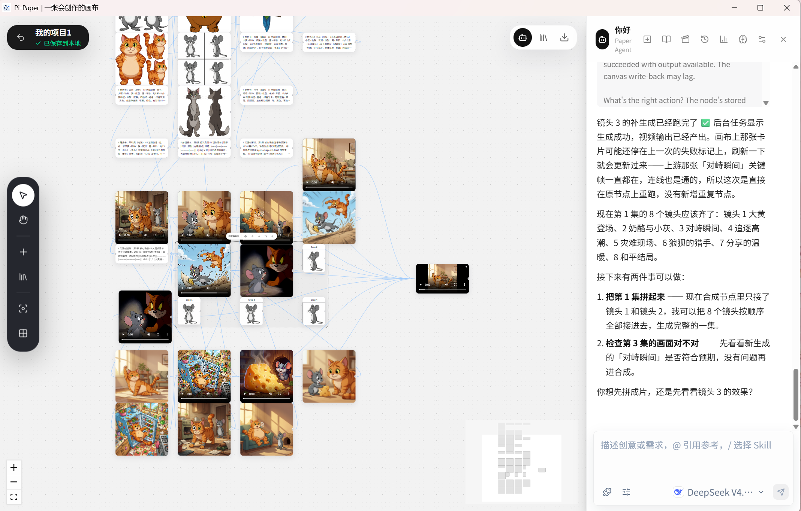
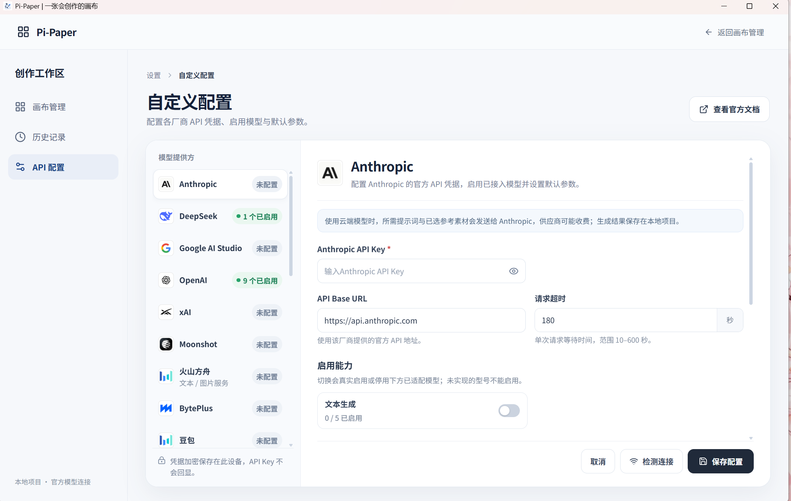

<div align="center">

# Pi-Paper Desktop

**A local-first AI canvas for creative production**

[](./LICENSE)
[](./vibepaper-desktop/README.md)
[](https://github.com/wsjwu58-cmd/Pi-Paper/tree/feat/desktop-local-migration)


Pi-Paper is a single-user desktop creative workspace. Connect text, images, video, audio, and production notes on an infinite canvas, then work with the Xiaop (小P) Agent to develop an idea into an editable workflow.

**Local project → Connected nodes → Generation → Editing → Composition → Export**

[Desktop setup and usage](./vibepaper-desktop/README.md) · [Migration and validation status](./docs/specs/desktop-agent-functional-spec.md)

</div>

---

## Branches

| Branch | Purpose |
| --- | --- |
| `feat/desktop-local-migration` | **Default branch.** Local desktop projects, the original canvas and Agent UI, local persistence, and provider adapters |
| `dev` | Historical Web and service development baseline retained for migration comparison |
| `main` | Historical Python service baseline retained for comparison; not the desktop startup path |

Use the default desktop branch for the instructions below.

## Feature Overview

| Capability | Desktop behavior |
| --- | --- |
| Canvas-first creation | Original infinite canvas with pan/zoom, six node types, autosave, connection rules, upstream references, and JSON import/export |
| Xiaop (小P) Agent companion | Original creative role and tool chain, canvas-aware conversation, progress, execution records, and local session history |
| Multimodal generation | Text, image, video, audio, and composition tasks through implemented model bindings; task status and specific failures remain visible in their nodes |
| Controlled workflows | Agent canvas edits use the local tool gateway. Single and batch generation require confirmation; recovery checks durable tasks and idempotency records before continuing |
| Short-form drama production | Local story/character/shot assets, production state, references, keyframes, video, and composition dependencies |
| Asset and reference library | Import supported local media, preview, reference, rename, replace, and download assets/results; preserve the source-to-result graph |
| Canvas organization | Box selection and grouping, horizontal/vertical arrangement, independent member dragging, ungrouping, and group downloads |
| Image cropping | Adjustable single-image, four-cell, and nine-cell crops; results become editable nodes in a group |
| Generation feedback | Reference previews, animated generation backgrounds, elapsed time, and white flow highlights over blue reference connections |
| Text reading | Markdown headings, lists, tables, quotes, and code blocks; double-click a text node for a large, scrollable reading view |
| Sessions, Skills, and memory | Session titles and management, reusable fragments, Skill snapshots, persistent plans, context compression, scoped memory, and memory candidate review |
| Local project management | Canvas showcase, real local task history, project covers, backups, and restoration; current storage is one canvas per project |
| Model configuration | User-configured official provider credentials and model defaults, with Agnes/Ark compatibility and local text service support; selectable capabilities follow the implemented catalog |

Desktop use does not require platform login, points, billing settlement, enterprise accounts, or Creative Gallery publishing. Cloud providers may charge for API requests. Local project storage does not prevent selected prompts and reference media from being sent to the chosen cloud provider.

## Desktop Showcase

The desktop app opens at the canvas showcase. Create or open a local project to enter the original canvas editor and Agent panel. Generated content stays in the project, and local task history remains accessible from the navigation.

### Canvas and Agent workflow

Connect character references, keyframes, video clips, and composition nodes in a local project, with the Agent conversation beside the canvas.

<p align="center">
  
</p>

### Provider configuration

Configure official provider credentials, enable implemented models, and set defaults in the desktop API configuration page. Credentials remain encrypted on the device and are not read back into the form.

<p align="center">
  
</p>

## Repository Structure

```text
vibepaper-desktop/      # Desktop host, local project/task services, IPC, and tests
vibepaper-web/          # Original pages, canvas nodes, editors, and Agent panel
pi-main/               # Pi source with desktop Agent and official media adaptations
  packages/vibepaper-agent-service/  # Original TypeScript Agent and local adapters
  packages/ai/         # Text and official media provider interfaces
  packages/coding-agent/ # Pi session, Skill, and compaction support
docs/                  # Desktop contracts, parity checklists, plans, and evidence
AGENTS.md              # Current desktop engineering contract

```

Legacy Java services, Python services, and Web deployment files are no longer tracked on the desktop branch. Their original implementation remains available in Git history for migration comparison; see the [source boundary and recovery instructions](./docs/specs/desktop-source-boundary.md). Existing local copies are preserved and ignored.

## Getting Started

### Requirements

- Node.js **22.19.0 or newer**, npm, and pnpm for the frontend lockfile.
- Network access for initial dependency installation and any cloud model calls you choose to make.
- FFmpeg for local video composition and relevant media processing. Set `VIBEPAPER_FFMPEG_PATH` / `FFMPEG_PATH`, or make FFmpeg available on `PATH`.
- Windows SAPI provides the current Windows local speech path; it is not a cross-platform speech implementation.

Desktop startup does not require Java services, Docker, PostgreSQL, Redis, Nacos, RocketMQ, or a platform account. There is no installer configuration in this directory yet; use source startup during development.

### Install

```powershell
git clone --branch feat/desktop-local-migration git@github.com:wsjwu58-cmd/Pi-Paper.git
cd Pi-Paper

npm --prefix pi-main ci
npm --prefix pi-main run build:offline
pnpm --dir vibepaper-web install --frozen-lockfile
npm --prefix vibepaper-desktop ci
```

`build:offline` builds Pi dependencies using local model data. It does not change whether later model requests use a local or cloud provider.

### Start the Desktop App

From the repository root, start development mode:

```powershell
npm --prefix vibepaper-desktop run dev
```

This starts Vite on `http://127.0.0.1:5173`, then launches Electron when the renderer is ready. The port must be available. Opening that URL in a regular browser does not provide the desktop project bridge.

For the built renderer:

```powershell
npm --prefix vibepaper-web run build
npm --prefix vibepaper-desktop start
```

The desktop `predev` / `prestart` hooks build the Agent Worker and Pi official media bundle automatically. Rebuild the renderer after frontend changes; restart Electron after Main/Preload or runtime icon changes.

### Configure Models and Create

1. Open **API 配置**, or **自定义配置** from a canvas model menu. Configure a provider, enable implemented models, and set their defaults.
2. Create or open a local project from **画布展示**.
3. Add nodes and connect references, or ask Xiaop to organize the canvas. Agent generation requests wait for explicit confirmation before submission.
4. Inspect results and errors in the nodes, download outputs, and review local tasks in **历史记录**.

Only implemented, enabled, capability-matching bindings can be called. A successful credential probe does not guarantee generation access to every model. Local text endpoints are restricted to loopback addresses, and their current catalog does not declare Agent tool-calling support.

Cloud API keys are handled by controlled processes and system encryption, not exposed to the Renderer or included in project exports. Model configuration discloses the provider, sent data, and potential fees; ordinary messages do not require a repeated API confirmation. Agent generation and high-risk actions retain their separate confirmations.

See the [desktop README](./vibepaper-desktop/README.md) for local file layout, project movement, single-writer locks, backups, recovery, and verification commands.

## Validation Status

- The latest canvas interaction repair passed the frontend build, 20 focused frontend regressions, and 32 local canvas-core tests. Narrow-window menus, durable edge deletion, generation animation fixtures, and text reading were checked in an isolated desktop project.
- Fixture protocols and UI checks do not replace real-account generation or long-running Agent recovery acceptance.
- Remaining acceptance work includes full original UI/domain parity, all supported official model accounts and input modes, local Agent capabilities, long-context stress, and installers on each target operating system.

Current contracts and evidence:

- [Desktop engineering contract](./AGENTS.md)
- [Desktop setup and usage](./vibepaper-desktop/README.md)
- [UI parity checklist](./docs/specs/desktop-ui-parity.md) and [backend domain comparison](./docs/specs/desktop-backend-parity.md)
- [Agent functional specification](./docs/specs/desktop-agent-functional-spec.md)
- [Provider registry](./docs/specs/desktop-provider-registry.md) and [provider data contract](./docs/specs/desktop-provider-data-contract.md)
- [Canvas interaction repair evidence](./docs/plans/2026-10-05-canvas-interaction-repairs.md)

## Project Notes

- Pi-Paper is independently developed for personal learning and experimentation and has no official affiliation with commercial products referenced by historical materials.
- Desktop behavior follows the current desktop contract. Older Web PRDs remain comparison material; legacy services and deployment files are available in Git history.
- Interfaces and behavior may change during migration. Focused issues and pull requests with reproducible desktop scenarios are welcome.

## License

[MIT](./LICENSE) © 2026 ShiJie Wu
