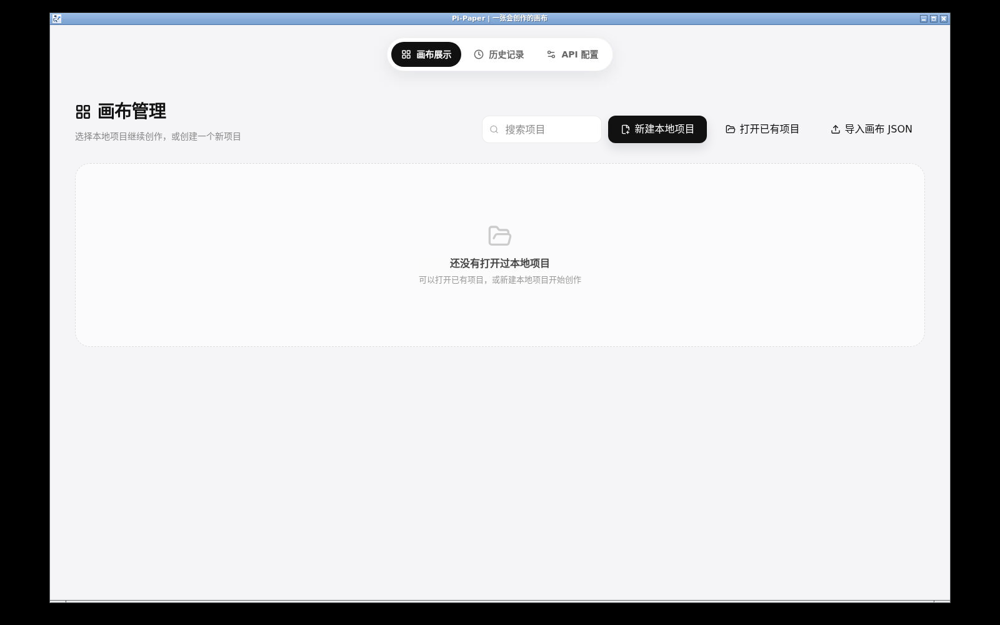

# Pi-Paper Docker / noVNC

在 Linux 容器中运行完整 Electron 桌面版，浏览器通过 noVNC 连接其虚拟桌面。画布、Agent、文件选择和生成仍使用同一套本地核心与原页面；项目数据保存在 Docker 主机的持久卷中。它是单用户远程桌面，不是历史 Web 多用户服务。

## 启动

需要 Docker Engine / Docker Desktop（Linux containers）和 Docker Compose v2。当前镜像为 Linux x64；Apple Silicon 主机通过 Docker 的 amd64 模拟运行。

在仓库根目录执行：

```bash
git clone --branch feat/desktop-local-migration https://github.com/wsjwu58-cmd/Pi-Paper.git
cd Pi-Paper
# 有 Node.js 时直接执行：node docker/create-secrets.cjs
# 或只使用 Docker，在 Bash / PowerShell 中执行：
docker run --rm -v "${PWD}:/workspace" -w /workspace node:24-bookworm-slim node docker/create-secrets.cjs
docker compose up -d --build --wait --wait-timeout 180
```

打开 **http://127.0.0.1:8080/vnc.html**，点击 Connect，输入初始化命令输出的 noVNC 密码。忘记时在本机查看 `docker/secrets/vnc-password.txt`。初始化脚本不会覆盖已有密码。

从 Pi-Paper 的画布展示页新建或打开项目，在文件选择器中进入 `/projects`。文件选择器显示的是容器文件系统；电脑上的素材需先导入挂载目录或使用 `docker compose cp`：

```bash
docker compose cp ./reference.png pi-paper:/projects/reference.png
```

需传回主机时使用 `docker compose cp pi-paper:/projects/your-project ./your-project`。noVNC 不自动映射浏览器电脑的文件，也不传输系统音频；音频预览可复制输出到本机播放。

## 配置与凭据

复制根目录 `.env.example` 为 `.env` 可更改端口和虚拟桌面大小。默认只绑定主机的 `127.0.0.1`，VNC 的 5900 端口仅在容器内部监听。远程主机可通过 SSH 转发访问：

```bash
ssh -L 8080:127.0.0.1:8080 user@your-server
```

也可放在自己已配置的 HTTPS、鉴权和 WebSocket 反向代理后。noVNC 具有完整桌面操作权限，请按单用户应用部署。

在原 **API 配置** 页配置模型。项目和用户数据保存在服务器，选择云端模型时所选请求内容仍会发送给供应商。FFmpeg 已安装在镜像中。Windows SAPI 不适用于 Linux 容器。

`desktop-home` 卷保存设置、会话全局数据和 GNOME 系统凭据库；`projects` 卷保存项目、素材、结果。`docker/secrets/keyring-password.txt` 用于重启后解锁凭据库，不能在已有数据卷上随意替换，否则旧凭据可能无法解密。两个密码文件已被 Git 和 Docker 构建上下文排除。

容器启动脚本短暂使用 root 复制主机的受限密码文件并调整卷根目录权限，随后以 UID/GID 1000 的 `pi-paper` 用户运行 Electron、VNC 和 D-Bus。容器内 Electron 使用 `--no-sandbox`，由容器提供进程隔离；Renderer 仍保留 `contextIsolation`、受限 IPC 和关闭 `nodeIntegration`。不要为此镜像添加 privileged、Docker socket 或宿主机敏感目录挂载。

本机模型配置目前只接受 loopback URL。在容器中 `127.0.0.1` 指向容器自身，不能直接填写宿主机模型地址；需要另行配置容器内 loopback 转发。不要把宿主机模型可用性当成已验证的容器能力。

## 停止、升级和备份

```bash
docker compose logs -f
docker compose down
# 更新源码后重新构建；已有持久卷和两个密码文件继续使用
git pull
docker compose up -d --build --wait --wait-timeout 180
```

`docker compose down` 保留数据卷；`down -v` 会删除数据。备份时先停止容器，再备份两个持久卷和 `docker/secrets/`，或者使用原应用的项目备份功能。项目备份不包含全局凭据；恢复到新环境需重新配置模型。

## 验证

[完整 Linux 容器验收已通过](https://github.com/wsjwu58-cmd/Pi-Paper/actions/runs/37397662837)，包含真实浏览器连接和容器重启检查。




`.github/workflows/docker-desktop.yml` 会实际构建镜像、等待 Electron 窗口与 noVNC 健康检查、验证包内 SQLite/Agent 恢复、建立带密码的浏览器 VNC 连接并保存截图，再重启容器核对项目卷持久化。此检查不替代真实供应商账号生成、完整 UI 保真或音频传输验收。

基础配置参考 [Docker Compose](https://docs.docker.com/reference/compose-file/services/) 和 [noVNC](https://github.com/novnc/noVNC)。
