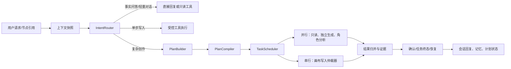

# Agent 系统：意图识别、任务规划、多 Agent 与 Skill 并行优化方案

> 状态：Phase 1、Phase 2 调度契约与 Phase 3 步骤状态机已实施；持久化执行器、多 Agent 协作待后续阶段
> 日期：2026-09-11
> 范围：`pi-main/packages/vibepaper-agent-service`；画布、生成、计费服务仍只能经既有 Tool Gateway 访问。

## 1. 结论与目标

当前 Agent 已具备 Pi 驱动的对话循环、工具白名单、确认令牌、会话/记忆、任务终态回调、Skill 快照、计划校验等可靠基础；短板在于这些能力尚未被一个统一的运行时编排器串联。实际效果是：系统主要依赖模型在单轮中自行判断意图并按顺序调用工具，复杂创作请求难以稳定拆解、并行、恢复和解释。

本方案不引入“自由自治的多模型集群”，而是把 Agent 演进为受控工作流：**先判断请求性质，再生成可校验的任务 DAG；只并行无副作用读操作和相互独立的生成提交；所有画布写入由单一仲裁器串行化；高风险动作继续走确认和点数冻结。**

目标：

- 把“闲聊/问事实/单步操作/复杂创作”稳定分流，避免不必要的模型和工具调用。
- 让多步骤创作具有可展示的计划、依赖、状态、失败原因和恢复入口。
- 在不破坏画布乐观锁、点数冻结和确认令牌的前提下，提高独立工作项的并行度。
- 将 Skill 从“按需贴入提示词”升级为可审计、可恢复、可组合的执行策略。
- 让短剧等高复杂度场景可以采用角色协作，但不让子 Agent 直接修改画布或绕过授权。

非目标：本轮不做多人实时协作画布、不开放任意第三方插件执行、不让 Agent 生成 SQL 或绕过 Tool Gateway，也不改变生成任务与点数的既有状态机。

## 2. 调研依据与当前系统事实

`learn-claude-code-main` 的 S1–S20 提供了可借鉴的机制，而不是应原样移植的产品。其核心启示可归纳为：S1/S2 是受控的 Agent-工具循环与安全并行；S3/S4 是权限与钩子；S5/S12 是从待办到可执行 DAG；S6、S15/S16/S17 是受边界约束的子 Agent、团队协议和自治；S7/S19 是渐进加载的 Skill/插件；S8–S11 是上下文、记忆、系统提示与错误恢复；S13/S14 是后台任务与调度；S18 是隔离副作用；S20 是将这些能力收敛成单一控制循环。

下表只记录已由当前源码确认的事实，避免把设计建议误写成现有能力。

| 主题 | 已确认实现 | 差距/风险 |
| --- | --- | --- |
| 意图分流 | [`profile-selector.ts`](../../pi-main/packages/vibepaper-agent-service/src/application/profile-selector.ts) 依据入口、画布领域、待处理动作选择画像 | 没有按用户语义、任务规模、风险和上下文充分度输出结构化意图；一般请求仍直接进入模型循环 |
| 计划 | [`plan-compiler.ts`](../../pi-main/packages/vibepaper-agent-service/src/application/plan-compiler.ts) 可校验工具白名单、依赖引用、批量上限和画布版本；[`pg-plan-repository.ts`](../../pi-main/packages/vibepaper-agent-service/src/infrastructure/pg-plan-repository.ts) 可保存计划 | 没有把自然语言请求持续编译为计划并调度 ready set；`PlanStep` 也没有租约、重试预算、效果类别或可恢复输出 |
| 工具执行 | [`runtime-tools.ts`](../../pi-main/packages/vibepaper-agent-service/src/tools/runtime-tools.ts) 的工具统一声明为 `sequential`；Tool Gateway、确认和生成执行器已存在 | 读操作与独立生成提交无法被调度器安全并行；画布写与副作用缺少显式并发键 |
| Skill | [`skill-tools.ts`](../../pi-main/packages/vibepaper-agent-service/src/tools/skill-tools.ts) 有索引、按需加载和会话快照；[`skill-governance-service.ts`](../../pi-main/packages/vibepaper-agent-service/src/application/skill-governance-service.ts) 有版本、能力和风险检查 | 已加载 Skill 在后续轮次只保留 ID，正文不会自动重新注入；治理与运行时装配没有形成统一策略 |
| 上下文与恢复 | 会话历史、压缩、受保护事实、记忆和任务终态回调均已接入 | 上下文预算尚未覆盖 Skill 正文、计划状态、子 Agent 产物；中断恢复依赖局部状态，无法从计划步骤级继续 |
| 多 Agent | 短剧画像、剧本/渲染等领域工具已具备 | 没有角色协议、共享工件边界、冲突合并和 Lead 仲裁；不应直接并行多个可写 Agent |

其中两个优先修复点尤其明确：

1. `resolveSkillContext` 仅向系统提示提供 Skill 索引，而 `load_skill` 对已加载 Skill 返回“已加载”与 URI，不再次返回正文。这会使跨轮次执行丢失方法论上下文。
2. 计划编译器已经能计算 `readySet`，但运行入口没有用它驱动执行。这是最小改造可以利用的现有资产。

## 3. 目标运行模型



### 3.1 IntentRouter：先确定“该如何做”，再让模型决定“说什么”

新增纯领域对象 `IntentDecision`，由规则优先、轻量模型兜底的方式产出：

```ts
type IntentDecision = {
  kind: "conversation" | "canvas_fact" | "read" | "single_write" | "creative_workflow" | "resume";
  profile: AgentProfile;
  confidence: number;
  requiresPlan: boolean;
  requiresConfirmation: boolean;
  selectedSkills: string[];
  referenceScope: { nodeIds: string[]; canvasVersion: number };
  reasons: string[]; // 仅用于审计，不回显内部 ID
};
```

决策顺序：

1. 先处理明确的续办、确认、取消和任务状态查询；这些必须绑定既有 run/确认令牌。
2. 用确定性规则识别节点数、画布事实、单一低风险写入、价格/模型变更、批量操作等；可直接复用目前的快速事实回复。
3. 请求包含多个可交付物、依赖描述、批量创作、短剧流程或需要跨节点编排时，标记为 `creative_workflow`，强制先产出计划。
4. 置信度不足时只提出一个澄清问题，不猜测资源、模型或覆盖范围。

Router 只负责分类和约束，不直接执行工具；它必须将 `canvasVersion` 固定到决策中，后续写操作仍由 Tool Gateway 做乐观锁校验。

### 3.2 Task DAG：用计划替换只在文本中描述的“待办”

在现有 `AgentPlan`/`PlanCompiler` 基础上扩展 `PlanStep`：

```ts
type Effect = "read" | "create_task" | "write_canvas" | "external_side_effect";
type ExtendedPlanStep = PlanStep & {
  effect: Effect;
  concurrencyKey?: string; // 同键互斥，例如 canvas:{id}
  retryPolicy: { maxAttempts: number; retryableCodes: string[] };
  leaseUntil?: string;
  outputRef?: string;
  idempotencyKey: string;
};
```

调度规则：

- 只调度 `dependsOn` 全部完成、输入哈希仍有效且租约未被占用的 ready step。
- `read` 可并行；`create_task` 仅在输入、参考节点和幂等键不同且预算已逐项确认时并行；`write_canvas` 和其他副作用按 `concurrencyKey` 串行。
- 并行仅缩短等待，不合并授权。每个生成提交仍各自估价、冻结、确认与记录。
- 任务失败时根据错误码和 `retryPolicy` 决定重试、等待用户、补偿或终止下游；不能隐式重跑已经产生外部副作用的步骤。
- 画布版本冲突将所有未执行写入标为 `stale`，重新拉取快照后由 Lead 重新编译受影响子图，绝不覆盖用户的新布局或节点。

计划的存储状态建议为 `draft → awaiting_confirmation → running → waiting_task → completed | failed | cancelled | stale`。这与现有生成任务状态机并存：计划是编排实体，生成任务仍保持 `queued/running/succeeded/failed/cancelled/expired`。

### 3.3 受控并行：并行的是工作，不是写入权限

将工具清单补充 `effect`、`concurrencyKeyFactory`、超时、是否可重试、是否需要确认和最大并发数。Pi 当前工具仍可保留 sequential 默认值；只有调度器调用的、通过测试的工具才允许批处理。

建议初始并发策略：

| 分区 | 示例 | 并发策略 |
| --- | --- | --- |
| 只读 | 读取画布、素材、任务状态 | 每用户最多 4；同一请求去重 |
| 规划/分析子 Agent | 分镜建议、素材检索建议、质量检查 | 每个计划最多 3；只写共享工件库 |
| 生成提交 | 多个相互独立的图/视频任务 | 每用户 2、每画布 3；每项独立确认/冻结 |
| 画布写入 | 创建节点、连线、布局、改配置 | 每画布 1；统一写入仲裁器 |

开始前应记录基线：同一画布、指定节点数、相同模型和预算下，测量首个可见结果、全部任务入队、计划恢复成功率、冲突率和确认拒绝率。没有基线前不承诺百分比提升。

### 3.4 多 Agent：Lead 负责承诺，角色只交付受类型约束的工件

仅为 `creative_workflow`（优先短剧）启用小型团队，采用固定角色而非递归随意派生：

| 角色 | 输入 | 输出 | 禁止事项 |
| --- | --- | --- | --- |
| Lead/编排者 | 用户需求、画布快照、已确认计划 | DAG、汇总、下一步 | 不绕过确认或直接篡改画布 JSON |
| 剧本 | 创作 brief、引用素材摘要 | 剧情节拍、角色/镜头约束 | 不提交生成任务 |
| 分镜 | 剧本工件、画布节点摘要 | 可验证的分镜/依赖建议 | 不创建节点 |
| 视觉/素材 | 分镜、素材清单 | 提示词和素材匹配建议 | 不写画布、不冻结点数 |
| 审核 | 计划和候选结果 | 风险、连续性、质量检查 | 不自行重试或发布 |

角色之间只通过持久化的 `AgentArtifact` 信封传递数据：`{planId, producerRole, schemaVersion, content, evidenceRefs, createdAt}`。Lead 验证 schema、合并冲突并唯一拥有工具执行权限。子 Agent 不得再派生子 Agent；超过时间/Token/调用预算时返回部分工件和原因。

### 3.5 Skill：把渐进加载变成“可恢复的策略依赖”

Skill 保持两级加载：系统提示只携带索引；命中需求时加载正文。但会话持久化的不是单纯 `loaded_skill_ids`，而是不可变快照：

```ts
type LoadedSkillSnapshot = {
  skillId: string;
  version: number;
  contentHash: string;
  capabilityGrant: string[];
  compactedInstructions: string;
};
```

下一轮运行时，按计划/意图选择少量已加载 Skill，将 `compactedInstructions` 重新注入到上下文预算中；模型确需全文时再读取对应版本。这样既不会每轮塞入所有正文，也不会出现“已加载但模型看不到方法论”。

Skill 可声明适用意图、输入/输出 schema、可用能力、风险等级和可组合的计划模板。发布仍经过 `SkillGovernanceService` 的内容、能力与上下文上限校验；实际可调用工具始终取用户权限、画像白名单与 Skill 能力的交集。`instruction-precedence.ts` 的优先级应在构建系统提示时真正使用：当前确认和用户指令永远高于 Skill。

## 4. 分阶段落地

### Phase 0：观测与保护网（优先）

- 为现有 run 增加 `intent_kind`、`plan_id`、工具 effect、队列等待、重试次数、Skill 快照版本等审计字段。
- 建立 30–50 条脱敏评测集：事实问答、单节点操作、跨节点创作、短剧、确认/拒绝、版本冲突、断线恢复和恶意 Skill 指令。
- 给计划编译、路由、Skill 再注入、调度器分区和写入仲裁器编写单元/集成测试；记录现状基线。

验收：所有新增日志具备 `user_id`、`canvas_id`、`run_id/plan_id`、错误码和成本字段；不在用户回复中暴露节点、会话或任务内部 ID。

### Phase 1：意图路由与 Skill 恢复（优先）

实施状态：已完成（`be4afed`）。

- 新增 `intent-router.ts`，先以确定性规则覆盖事实问答、确认续办、单步写入和复杂工作流，再以小模型分类兜底。
- 把已加载 Skill 从 ID 升级为版本快照，在下一轮按预算注入压缩指令；接入指令优先级解析。
- 保留现有 Pi 对话路径作为 feature flag 回退；路由置信度低时只澄清，不自动执行。

验收：跨轮次使用同一 Skill 的工作流能复现方法论；事实问答不进入通用工具循环；错误分类可一键退回旧路径。

### Phase 2：计划驱动的单 Agent 编排（优先）

实施状态：已完成计划编译与 ready-set 分区契约；持久化执行器待后续阶段。

- 将 `PlanCompiler` 接到 `creative_workflow` 入口；先支持只读、创建生成任务和串行画布写入。
- 实现持久化步骤状态、输入哈希、租约、重试和 stale 重编译；SSE 回显用户可理解的计划进度。
- 引入每画布写入仲裁器，所有写入仍经 `CanvasCommandService`/Tool Gateway。

验收：刷新或 Agent 重启后，运行中的计划可从最后一个安全检查点继续；画布版本变更不会覆盖用户操作，受影响步骤明确标记等待重新规划。

### Phase 3：受控并行与异步恢复（后续迭代）

实施状态：已完成步骤租约、同并发键互斥、幂等键和终态状态机；持久化调度器与任务终态关联待后续阶段。

- 落地 effect 分区、每用户/画布并发额度、去重和公平队列。
- 将现有任务终态回调关联到 `PlanStep`，自动解锁下游 ready set。
- 先灰度只读并行，再灰度独立生成提交；写入始终单通道。

验收：重复回调幂等、同一幂等键不产生重复任务、并发上限可观测，且压测中没有跨画布串写。

### Phase 4：短剧角色协作（条件触发）

前提是 Phase 2/3 的计划与工件协议稳定。先启用“剧本 + 分镜 + 审核”三个只读角色，由 Lead 汇总；视觉角色和自动生成提交后置。只有评测显示复杂短剧任务在计划完整性、返工率或人工接管次数上有明确改善，才扩大角色数量。

## 5. 安全、回退与验收边界

- **授权与计费**：生成、模型切换、参数变化超过阈值、批量创建和覆盖输出继续要求确认；计划不能成为一次确认后无限执行的通行证。确认令牌仍绑定用户、画布版本和操作摘要。
- **并发与一致性**：计划编排不改变画布的乐观锁；最终动作立即落盘，非最终增量仍按 300–500ms 防抖。版本冲突静默刷新 UI 可以保留，但服务端必须留下审计事件。
- **隔离**：子 Agent 仅访问裁剪后的事实、节点摘要和工件，不得到数据库连接、原始全量会话或直接写工具。对外部插件维持 deny-by-default。
- **成本/超时**：计划、子 Agent、Skill 和每种并行分区都设 Token、时长、工具调用和点数预算；超限进入 `waiting_user` 或失败，而非静默降级为未授权生成。
- **回退**：每个 Phase 由独立 feature flag 控制；关闭后新请求走当前顺序 Pi 路径，已创建的生成任务继续由既有终态处理流程结算。计划数据保留只读，禁止在回退时删除。

## 6. 建议实施顺序

1. 先完成 Phase 0 的评测与可观测性，并用真实画布场景固定基线。
2. 实施 Phase 1，解决最明显的意图误判与跨轮次 Skill 失忆问题。
3. 在短剧以外的普通多节点创作上实施 Phase 2，验证 DAG、冲突和恢复。
4. 只有前两类路径稳定后再启用 Phase 3 并行；最后用 Phase 4 扩展多 Agent。

这种顺序复用现有 Pi、计划、确认、任务终态和画布版本能力，能够把风险限制在可回退的层级，而不是一次性替换核心 Agent 循环。

## 7. 覆盖边界

本方案已静态审阅 Agent 服务的运行入口、画像选择、计划编译与存储、运行时工具、Skill 加载/治理、会话上下文和任务终态链路，并对照 `learn-claude-code-main` S1–S20 的示例机制。未进行生产流量、真实模型质量或并发压测；并发数、Token 预算和具体阈值需在 Phase 0 基线后配置，不应在没有测量的情况下承诺性能数值。
