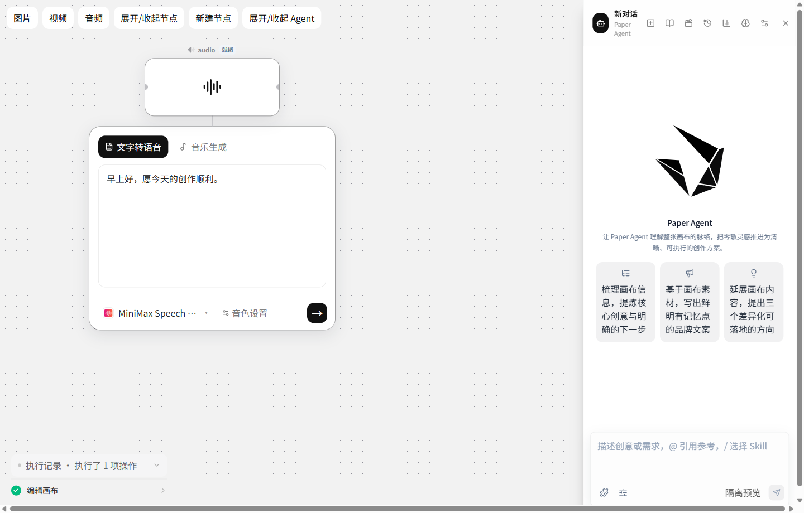
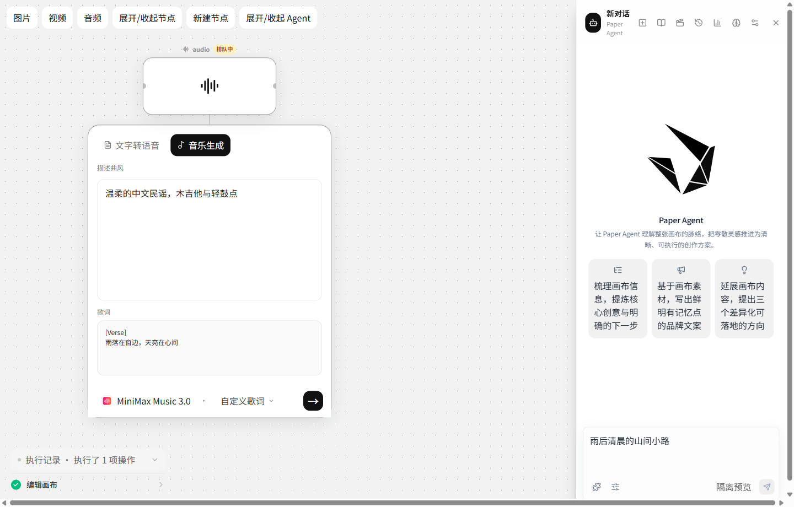
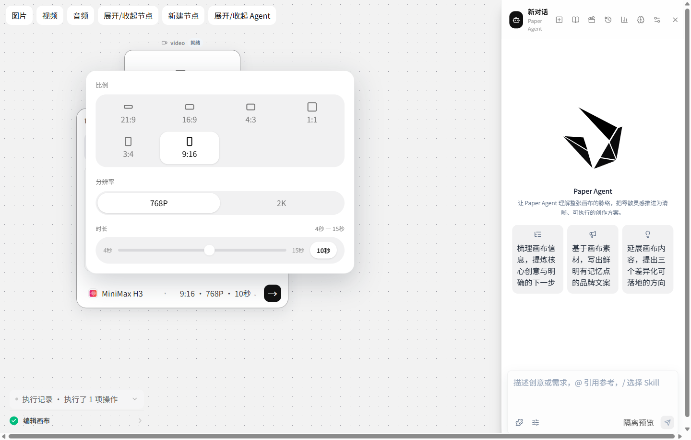
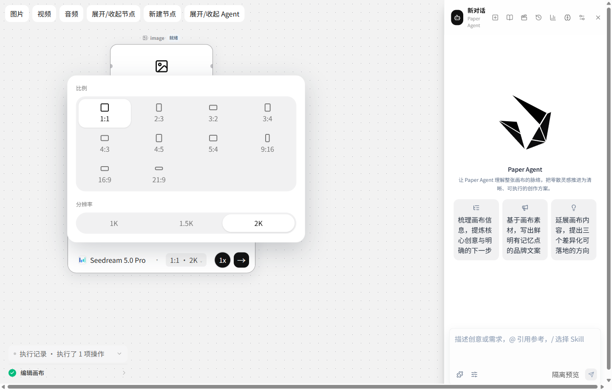
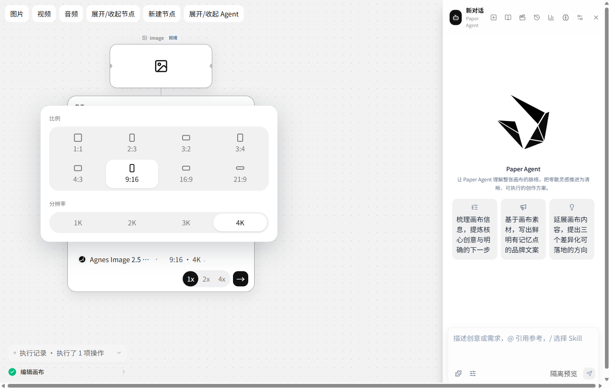
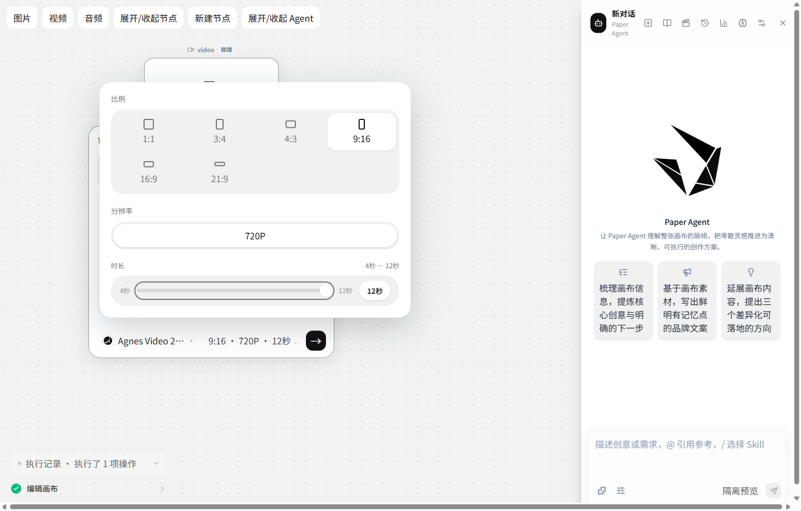
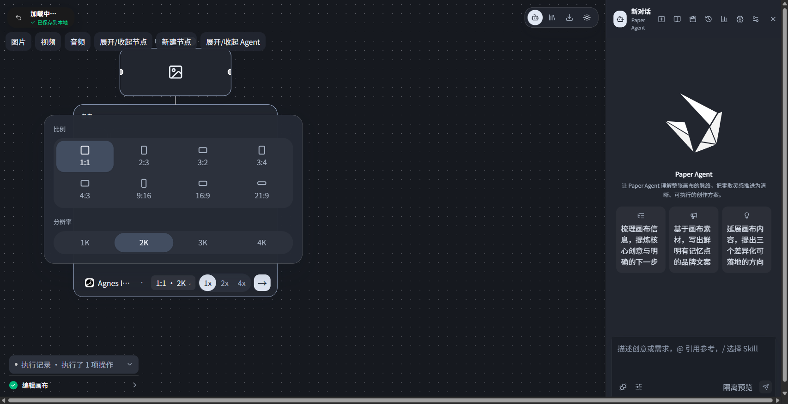
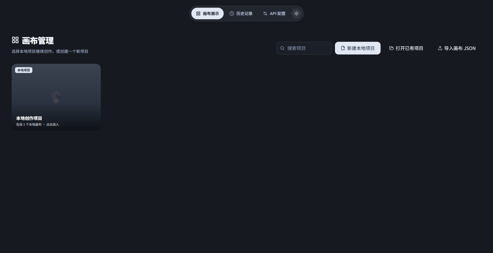
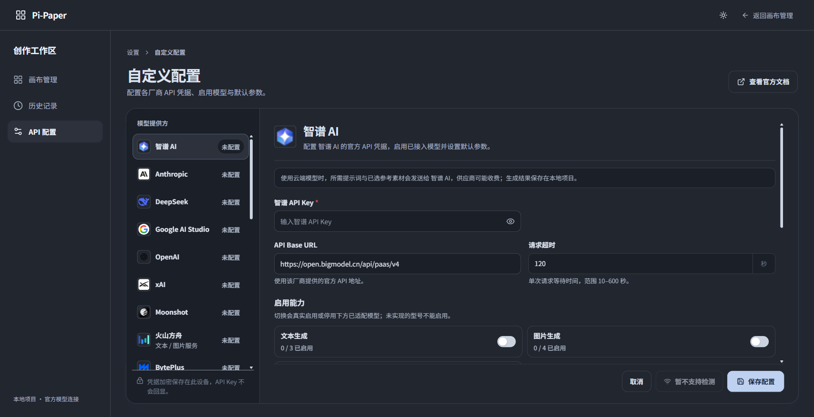

# 媒体编辑、官方模型与画布动效验收

日期：2026-10-06。直接修改原 NodeEditorPanel、SplitNodeLayout、CanvasPage、AgentPanel 与 Pi 官方媒体适配；没有平行桌面创作界面。按用户要求派发 Luna / max 子 Agent 后，子 Agent 因账户额度中断，剩余工作由主 Agent 集成完成。

## 可见行为

- 音频仅「文字转语音」「音乐生成」两模块；模型选择按操作类型过滤。语音使用模型声明的音色或设置中的 Voice ID；音乐有自动写词、自定义歌词、纯音乐。没有音色创作入口，没有模拟音色。
- 图片／视频底栏合并显示规格；弹层使用比例形状网格、白色选中分段和灰色时长滑杆。离散模型只能选声明档位，连续时长按上下界和步长选择，固定时长只读。切换模型／比例同步调整不兼容规格。
- 节点展开 280ms、收起 180ms、新节点出现 240ms；Agent、确认卡、执行记录、模型菜单、素材面板及画布菜单应用相同轻柔缓动。自动整理仅对视图位置插值，最终位置立即写入状态；定位画布 380ms。拖动／连线即时响应，侧栏拖动调整宽度取消过渡。关闭期间内容 inert；快速反向切换取消旧计时；系统减少动态效果时无动画。
- Main 快照参数时消除被显式选择覆盖的默认别名；Worker 校验并统一画幅、尺寸和时长。冲突参数在发送前报错，风格／运镜作为明确提示词要求保留。未声明能力不显示通用 720P／2K 等虚构选项。

## 本轮新增官方绑定与来源

原 72 个目标保留。新增 21 项，总目录 93 项，其中协议 implemented 86 项；implemented 不表示账号生成已经验收。所有新增文本绑定当前只开放桌面已经实现的文本输入和 Pi 工具调用，未把厂商视觉输入等未接入能力冒充可用。

| 厂商 | 新增真实调用 ID | 官方来源 |
| --- | --- | --- |
| 智谱 | glm-5.3、glm-5.3-flash、glm-5.3-flashx | [GLM-5.3](https://docs.bigmodel.cn/cn/guide/models/text/glm-5.3)、[Flash](https://docs.bigmodel.cn/cn/guide/models/vlm/glm-5.3-flash) |
| 智谱图片 | glm-image、cogview-4、cogview-4-250304、cogview-3-flash | [图像生成](https://docs.bigmodel.cn/api-reference/模型-api/图像生成) |
| 智谱视频 | cogvideox-3 | [模型说明](https://docs.bigmodel.cn/cn/guide/models/video-generation/cogvideox-3)、[视频生成](https://docs.bigmodel.cn/api-reference/模型-api/视频生成异步)、[查询结果](https://docs.bigmodel.cn/api-reference/模型-api/查询异步结果) |
| OpenAI | gpt-6.1-sol | [型号说明](https://developers.openai.com/api/docs/models/gpt-6.1-sol) |
| Anthropic | claude-sonnet-5-5 | [型号目录](https://platform.claude.com/docs/en/models/overview) |
| Moonshot | kimi-k3、kimi-k2.7-code、kimi-k2.7-code-highspeed | [型号目录](https://platform.kimi.ai/docs/models)、[K3](https://platform.kimi.ai/docs/guide/kimi-k3-quickstart)、[K2.7 Code](https://platform.kimi.ai/docs/guide/kimi-k2-7-code-quickstart) |
| 百炼 | qwen3.8-max、qwen3.8-flash | [文本型号目录](https://www.alibabacloud.com/help/en/model-studio/text-generation-model) |
| MiniMax | MiniMax-M3、music-3.0 | [型号目录](https://platform.minimax.io/docs/guides/models-intro)、[Messages 接口](https://platform.minimax.io/docs/api-reference/text-chat-anthropic)、[音乐接口](https://platform.minimax.io/docs/api-reference/music-generation) |
| xAI | grok-imagine-image-2.0 | [图像生成](https://docs.x.ai/developers/model-capabilities/images/generation) |
| ElevenLabs | eleven_v4、eleven_v4_turbo、music_v2_5 | [型号目录](https://elevenlabs.io/docs/overview/models)、[Dialogue](https://elevenlabs.io/docs/api-reference/text-to-dialogue/convert)、[音乐](https://elevenlabs.io/docs/api-reference/music/compose)、[手工歌词计划](https://elevenlabs.io/docs/eleven-api/guides/how-to/music/composition-plans) |

智谱使用官方 v4 地址、Bearer Key、官方品牌图标及设置／画布分组。未核实安全无费用鉴权探测，连接检测返回不支持，不能显示格式检查成功。图片按官方像素边长、步长、总像素范围提供匹配比例的精确尺寸，保持水印开启。CogVideoX-3 支持 5／10 秒：16:9 提供 720p／1080p／4K，9:16 提供 720p／1080p，1:1 为 1024x1024；最多两个 PNG／JPEG 参考，沿用异步提交检查点及查询恢复。

MiniMax 音乐官方 API 对新账户有限制，设置中明确提示权限条件。MiniMax M3.1 Flash Preview 当前为 M-Plan／Code 入口，未作为普通 API Key 型号开放。Eleven 音乐不需要音色凭据；v4 语音使用 Dialogue 请求，不能沿用旧 TTS 路径。MiniMax Music 2.6／3.0 码率按当前官方枚举校验。

其余原目录厂商沿用已实现的精确调用 ID 和能力子集；本轮不意味着全部厂商所有最新产品、编辑、参考输入和后处理均已实现。7 个目标仍明确不可用：Gemini Omni Flash、停用 Kimi K2.5、下线 Seedance 1.5 Pro、暂不做的 Doubao Voice Creation、无本地适配的 MiniMax H3 Local、没有公开生成 API 的 Midjourney V8.2、未核实旧 ID 的 Happyhorse。

## 验证结果和边界

- Pi 9 个指定协议测试文件：87 项通过，包含智谱鉴权／请求／像素校验、提交后轮询、恢复不重复 POST，以及 Eleven v4／音乐模式。未运行会使用真实账户的全量端到端套件。
- 桌面 8 个指定文件：33 项通过，覆盖模型默认参数快照、30 个官方文本绑定的实际 Pi 协议、全部目录默认媒体参数、音频输出落盘、异步任务恢复及非默认图片／视频规格。Web 参数测试 8 项通过。
- Web TypeScript、Pi 根 TypeScript 与相对导入检查通过；本轮 15 个 Pi 文件的 Biome 检查通过。未运行会自动格式化整个仓库的 `npm run check`，以保留已有其他任务改动；因此不宣称其全部子检查已完成。
- Web 生产构建、桌面 Agent／媒体 Worker 构建通过。原构建仍提示 bundle 较大、静态和动态导入重叠；CJS Worker 的未使用 OAuth／Bedrock 延迟入口仍有 import.meta 构建警告，这不构成这些入口运行验收。
- 原组件的隔离浏览器预览使用完整公开能力目录、模拟桌面 IPC。真实点击图片 9:16／2K，视频 9:16／2K／10 秒，音乐手工歌词，实际 NodeEditor → submitNodeTask 提交字段与选择一致；供应商协议测试进一步验证转换后的请求与本地文件。未对用户付费账户发起生成。
- 动效浏览器验证：节点从 440×511 收起，在约 70ms 采样为 396×349，结束为 280×106；Agent 快速关闭后再打开恢复 380px 且解除 inert；新节点具有出现动画；减少动态效果下 transition 为 0s。原组件截图如下。这是隔离预览证据，不是旧 Web／桌面同状态全部逐屏对照、三平台安装包或大画布性能验收。

真实图片像素尺寸、视频分辨率／时长的最终媒体验收仍需各厂商真实账户权限与实际输出；当前证据证明参数确实到达已实现请求协议，不能保证供应商对所有提示词和参考的执行结果。

## Agnes 2.5 规格按钮回归修复

用户反馈 Agnes Image 2.5 Flash 的规格按钮无法点击。原因是旧 Agnes 路由已实现画面参数，但公开能力目录缺少 defaults／constraints，规格组件因没有选项而被禁用。

已按现有 generation-worker 请求构造器补齐目录：图片为 8 种比例、1K／2K／3K／4K；视频为 6 种比例、720P、4–12 秒。保留 legacy-agnes 调用路由。没有声明规格的其他模型仍可打开弹层查看说明，不提供虚构选项。

验证：Pi official-media 14 项通过；新增 legacy-agnes-specification 2 项通过，遍历目录全部图片比例／档位及视频比例／时长，确认现有请求构造器接受并保留选择。Web／Pi TypeScript、指定 Pi 文件 Biome、Web 生产构建与桌面 Worker 构建通过。隔离浏览器中实际点击图片 9:16／4K、视频 9:16／720P／12 秒，节点保存字段一致；视频 NodeEditor 提交到模拟 IPC 的任务参数也一致。未调用付费生成接口。已通过正常关闭流程重新启动桌面应用加载修复。

## GitHub 推送集成验证

在独立工作区将本轮提交接到远程最新分支，保留远程已完成的 pi-paper-web／pi-paper-desktop 目录重命名。本机共享工作目录、其他任务的改动与运行中的桌面应用均保持原样。

补齐已有离线模型元数据后，独立工作区的 Pi `npm run check` 完整通过（Biome、依赖版本、相对导入、shrinkwrap、安装锁、TypeScript、浏览器打包检查）。检查器自动格式化的 47 个其他基线文件恢复原样，不纳入本轮提交。合并后的 Pi 指定协议测试 87 项、桌面指定测试 35 项、Web 参数测试 8 项，共 130 项通过；前端完整 TypeScript 和生产构建通过，原有 bundle／导入方式警告仍存在。

## 桌面亮暗模式

在原 CanvasTopBar、PillNav 和 API 配置页顶栏加入可用键盘操作的太阳／月亮按钮。统一 html 主题变量，使 body 中的规格／模型选择等 Portal 与节点、Agent、画布展示、历史记录、API 配置同步切换。默认浅色，在本机 localStorage 保存 `vibepaper:appearance`；入口在第一次 React 渲染前应用已保存的偏好。存储不可用时仍允许本次会话切换。Web 旧账户偏好路径保持原样。

原组件隔离浏览器验证：点击切到深色，画布、Agent、输入框、规格弹层变为暗色；刷新继续显示深色，按钮变为“切换到浅色模式”。从画布展示进入历史记录、API 配置时选择继续保留；切回浅色，API 配置主背景恢复白色、原标题色恢复。原图片内容不做滤镜修改，只有 Agent 的单色品牌标记在深色下变为浅色。Web TypeScript 与生产构建通过。此前临时工作区归档误影响的 Pi 缺失文件已从本地 Git／已推送媒体提交恢复，离线工具链已恢复；Pi TypeScript、19 项指定模型测试及 5 项桌面规格测试通过。

