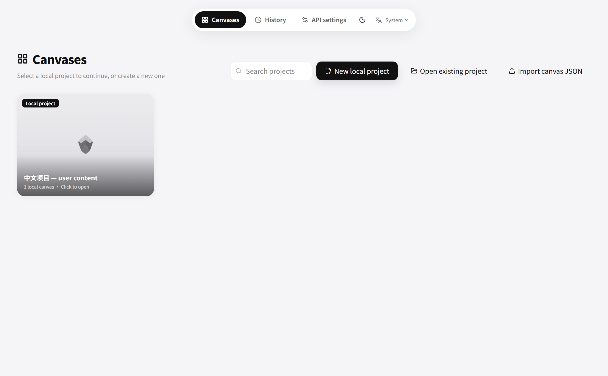
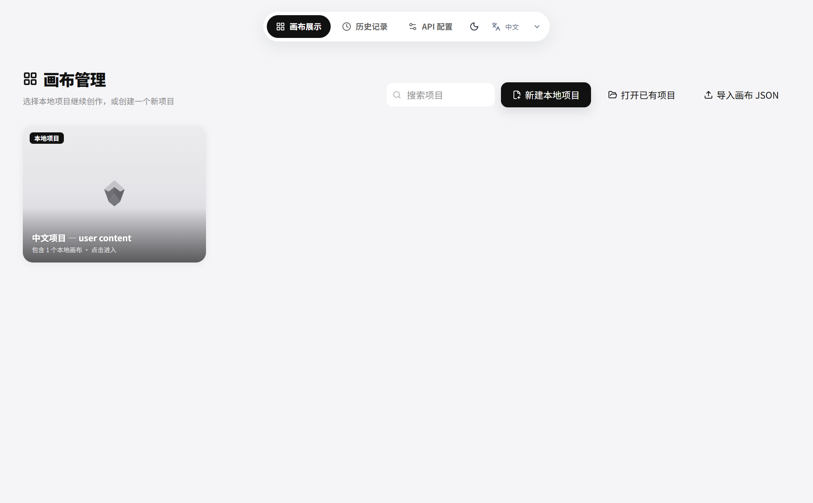
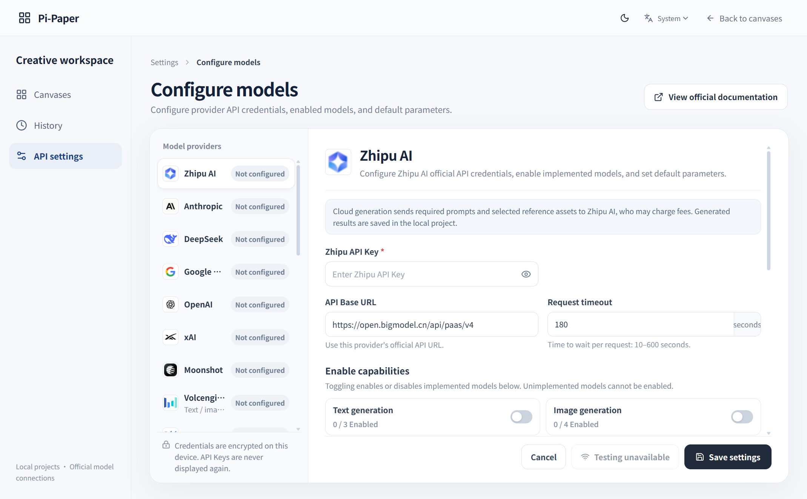
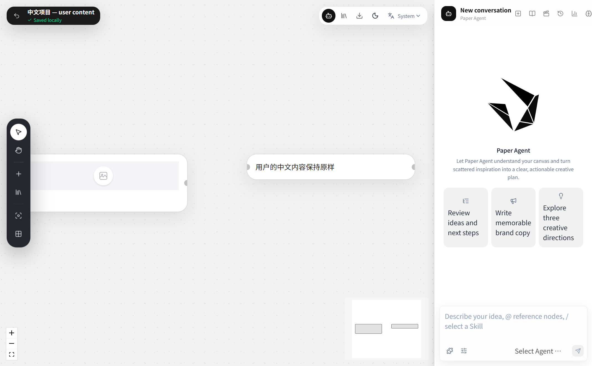
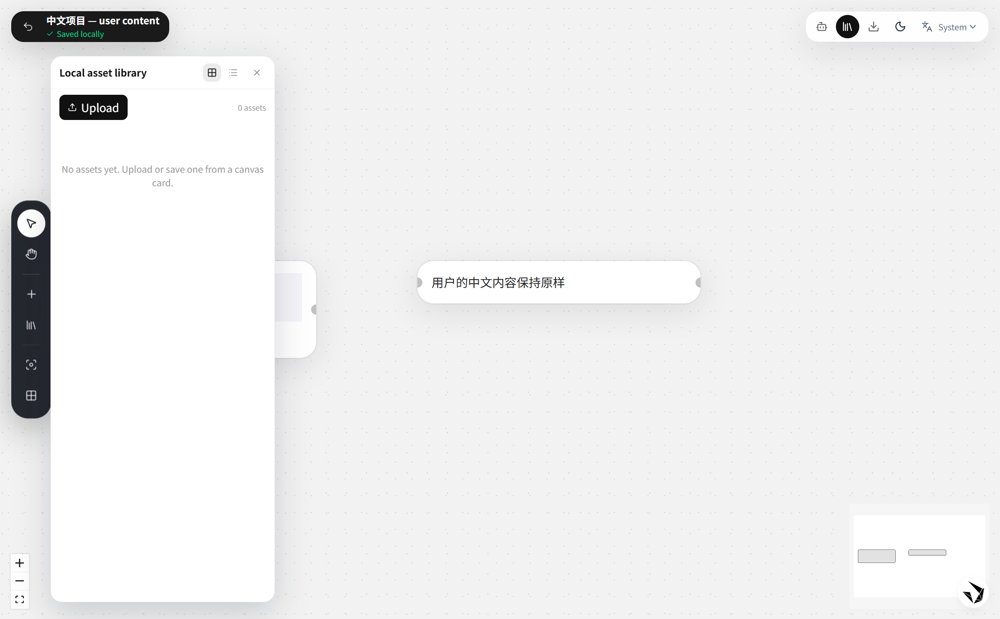
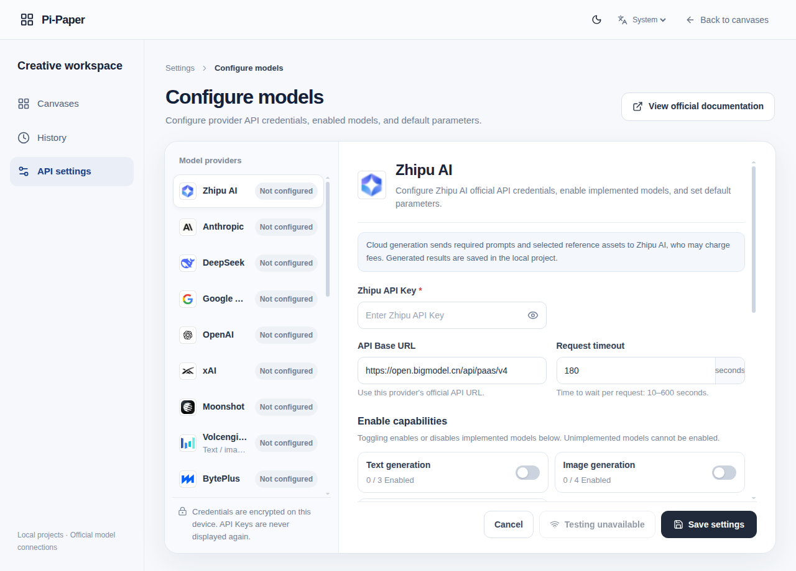

# 桌面界面语言验收（2026-10-08）

来源：[AppImage PR #9800 的界面语言要求](https://github.com/AppImage/appimage.github.io/pull/9800#issuecomment-6046397629)。实现中文区域默认中文、其余区域默认英文，并增加「跟随系统 / 中文 / English」的持久化选择。

## 实现范围

- 在原前端页面、画布、节点编辑器、Agent、素材、Skill、记忆、导演台和模型配置组件中接入英文词典，原 Web 路径保持中文。
- Renderer 挂载前读取 Main 的系统区域与保存偏好；切换立即更新界面、文档语言与标题。原生对话框的应用标题和提示跟随语言，系统对话框自带按钮由操作系统负责。
- 偏好保存到独立 `ui-settings.json`，使用受限 IPC、枚举校验与原子替换；项目名、节点内容、用户提示词、实际 Agent/供应商回复与业务枚举保持原文。

## 验证结果

| 检查 | 结果 |
| --- | --- |
| TypeScript 与 Vite 生产构建 | 通过 |
| 前端测试（浏览器存储夹具） | 27 个文件、128 项通过 |
| 语言、可信来源、节点导出、项目导航桌面测试 | 18 项通过 |
| Windows Electron，系统区域 `fr` | 默认英文；中文、英文、跟随系统切换通过 |
| 中文手动偏好，非中文区域重启 | 保留中文，见 `restart.json` |
| 原生项目选择标题 | 英文与中文均通过 |
| 用户中文项目名和节点正文 | 未改变，通过真实本地项目读取确认 |
| Linux 区域优先级 | 单元测试覆盖 `LC_ALL / LC_MESSAGES / LANG` 及回退 |

Electron smoke 使用仓库 `.test-temp/ui-language-smoke-profile` 隔离目录，创建两个真实本地节点，未读写真实用户配置和 Key；没有调用模型。报告见 [smoke.json](smoke.json)、[restart.json](restart.json)。截图覆盖画布展示、历史记录、配置、画布、Agent 和素材入口。

### 复现

从仓库根目录执行（已有依赖与 Pi 构建产物）：

```powershell
npm --prefix pi-paper-web run build
node --test --test-isolation=none pi-paper-desktop/test/ui-language.test.cjs pi-paper-desktop/test/renderer-trust.test.cjs pi-paper-desktop/test/node-export.test.cjs pi-paper-desktop/test/project-navigation.test.cjs
& ./pi-paper-desktop/node_modules/.bin/electron.cmd ./pi-paper-desktop/scripts/smoke-ui-language.cjs
& ./pi-paper-desktop/node_modules/.bin/electron.cmd ./pi-paper-desktop/scripts/smoke-ui-language.cjs --resume
```

macOS/Linux 对应使用 `./pi-paper-desktop/node_modules/.bin/electron`。Electron 脚本最终结果以报告中的 `success` 为准；`--resume` 必须在首次 smoke 成功之后单独运行。

本机 Node 25 的 Web Storage 与原 `nodeDownloads.test.ts` 测试环境冲突，直接运行全套 Vitest 会在该文件加载时遇到 `localStorage.getItem is not a function`。完整 128 项验证为 Vitest 增加临时 `setupFiles`，替代 Node 原生 Web Storage；未修改产品代码或该既有测试。仓库根目录 `.test-temp/i18n/storage-setup.ts` 夹具为：

```ts
import { vi } from '../../pi-paper-web/node_modules/vitest/dist/index.js'
vi.stubGlobal('localStorage', { getItem: () => null, setItem: () => {}, removeItem: () => {} })
```

`pi-paper-web/.test-temp/vitest-ui-language.config.mts` 合并原配置：

```ts
import { defineConfig, mergeConfig } from 'vite'
import config from '../vite.config.ts'
export default mergeConfig(config, defineConfig({ test: { setupFiles: ['../.test-temp/i18n/storage-setup.ts'] } }))
```

运行 `npm --prefix pi-paper-web run test -- --config .test-temp/vitest-ui-language.config.mts`。临时夹具仅用于这次本机测试，不属于产品配置。

## 截图与边界







其他截图：[英文历史记录](history-en.png)、[英文画布](canvas-en.png)、[中文偏好重启](workspace-zh-after-restart.png)。最初的界面验证运行于 Windows；后续四个平台的原生安装包构建及 Linux 打包资源界面检查已通过，记录见下文。仍未完成各平台完整手工安装、卸载与全部 UI 保真验收。外部内容、供应商原始错误、用户 Skill 与 Agent 输出不做自动翻译。


## 后续发布构建验证

源码提交：`476e0c33a308d7c0395841e51e645adcc67dab00`。整合时保留 GitHub 主分支的 `pi-paper-web / pi-paper-desktop` 目录命名；本机旧目录的全部授权源码改动已经整合，既有远端模型、主题与打包改动保留。

- [原生构建与检查](https://github.com/wsjwu58-cmd/Pi-Paper/actions/runs/37783338921)：Windows x64、macOS x64、macOS arm64、Linux x64 全部成功。各平台运行包内 SQLite 画布恢复及 Agent Skill/片段恢复 smoke；生成 Windows EXE、两个 macOS DMG、Linux AppImage 和 DEB。
- [CI](https://github.com/wsjwu58-cmd/Pi-Paper/actions/runs/37783358548)：前端 lint/构建、Pi Agent lint/类型/单元测试、桌面 Worker/画布测试全部通过。本机整合源码的前端 128 项、桌面 79 项及旧凭据读取 2 项、模型协议 19 项和 Agent 380 项测试通过。
- Linux 在 Xvfb 中运行安装包暂存目录的 Main、Preload、Renderer 与本地核心，使用匹配的 Electron 运行时。法语区域下默认英文、显式中英文选择、跟随系统、中文偏好重启、原生对话框标题及中文用户数据保真全部通过；见 [Linux smoke](linux/smoke.json)、[重启报告](linux/restart.json)。该检查不是 AppImage 的完整手工安装验收。
- Linux 首次检查发现无系统凭据库时读取不存在的旧 Agnes/Ark Key 会阻断配置页；已改为先确认文件存在，文件不存在返回未配置，有文件仍要求安全凭据库。回归测试验证缺失文件不访问凭据库、已有文件在凭据库不可用时不解密。前端重复的条件语言 Hook 也已修复。



其他 Linux 截图：[英文画布展示](linux/workspace-en.png)、[英文 Agent](linux/agent-en.png)、[中文选择](linux/workspace-zh.png)。CI runner 未安装中文字形，因此用户中文内容或中文界面可能显示缺字方框；本地权威项目读取确认正文保持原样。上方 Windows 截图展示完整中文字形。安装包来源与 SHA-256 将随 [v0.1.0 Release](https://github.com/wsjwu58-cmd/Pi-Paper/releases/tag/v0.1.0) 的构建清单保存。
